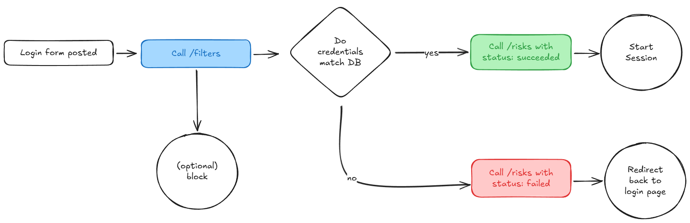

# The process of securing the login flow

Both endpoints, /risks and /filters, return a score, which is a number between 0 and 1, with higher scores indicating greater risk. The process of securing the login flow is divided into two key stages.

In the first stage, the incoming requests are assessed to determine whether they originate from automated bot attacks. This preliminary evaluation helps filter out high-risk requests early on, even before proceeding to authentication. By analyzing patterns and behaviors typically associated with bots, this step aims to mitigate threats and enhance system performance by prioritizing legitimate requests for further validation.

In the second stage, the focus shifts to verifying whether the request genuinely originates from the customer whose account is the target of the login attempt. This step incorporates more specific checks to ensure that even requests passing the first stage are thoroughly evaluated for authenticity and legitimacy.

Additionally, if the calculated risk score for any request exceeds a threshold of 0.9, it is recommended that such requests be automatically rejected. This approach establishes a decisive safeguard against highly suspicious activities, providing an extra layer of defense to protect user accounts and system integrity.

## Login flow diagram

(https://excalidraw.com/#json=gPRjonAbiXY5UfD3w1983,gwwR0c9NgZCugyZAfTzomQ)